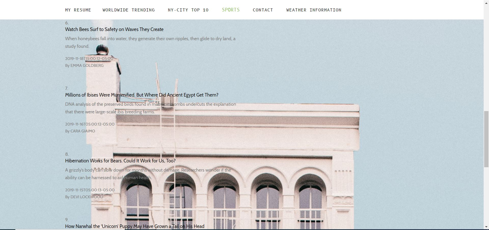
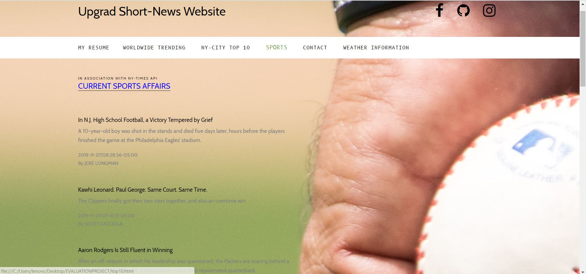

# UpGrad Short-News Website

It's almost 2020, Who's got time to sit and read a long newspaper just to stay updated.
Here's Upgrad's Short-News Website for you busy people! it's news on the go, read only
important stuff and stay Up to date on International news, New York's very own Top 10
and our very favourite adrenaline filled sports news in just under 5 minutes! not only
this but you can also stay updated on the weather in your city !    

#Technologies Used -
## HTML
## CSS
## BOOTSTRAP
## JAVASCRIPT
## JQUERY
## AJAX

#List of Endpoints - 
## Worldwide News :- https://developer.nytimes.com/docs/timeswire-product/1/overview  (api link)[authorization/verification done]
 
## New York City's Top 10 NEWS  :- https://developer.nytimes.com/docs/top-stories-product/1/overview (api link)[authorization/verification done]
 
##Sports News :-
 
## Weather Report(City/Country) :- https://openweathermap.org/current (api link)[authorization/verification done]
 

#Live Link : - 
